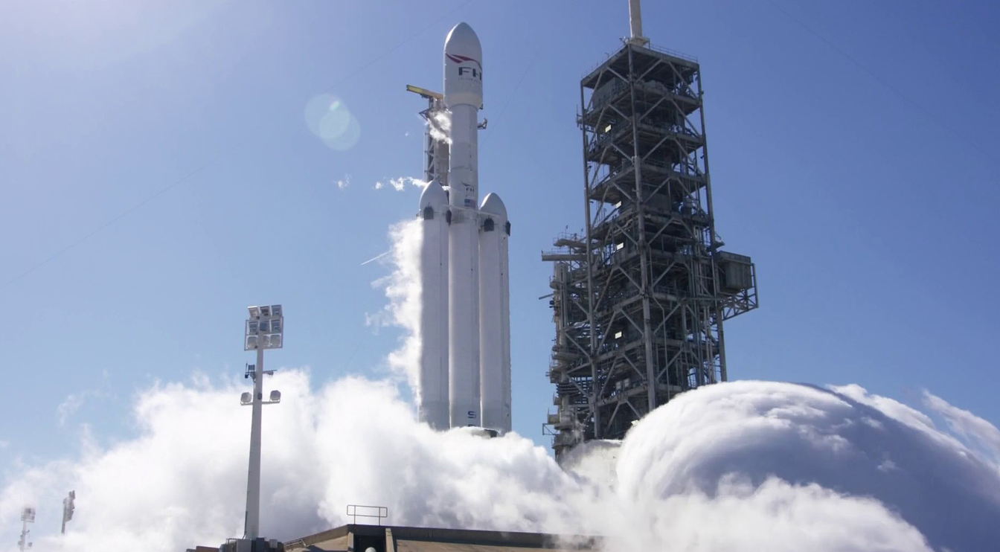
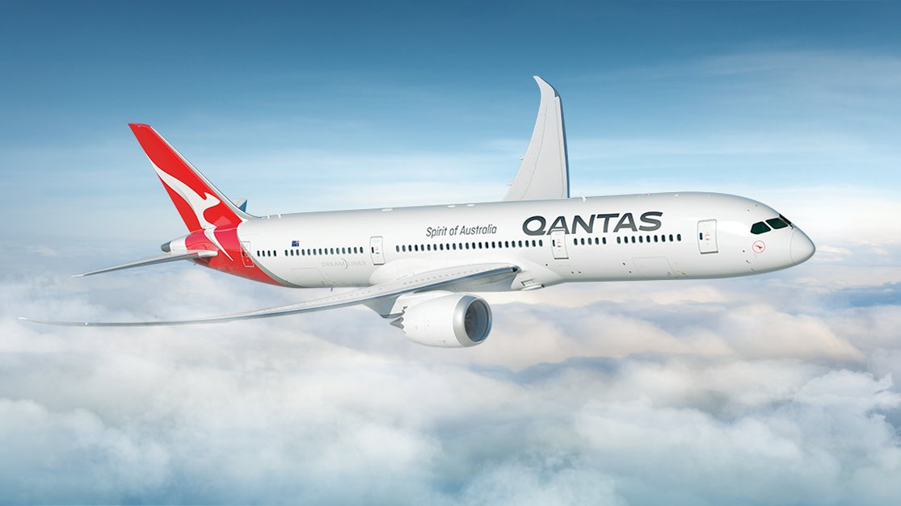
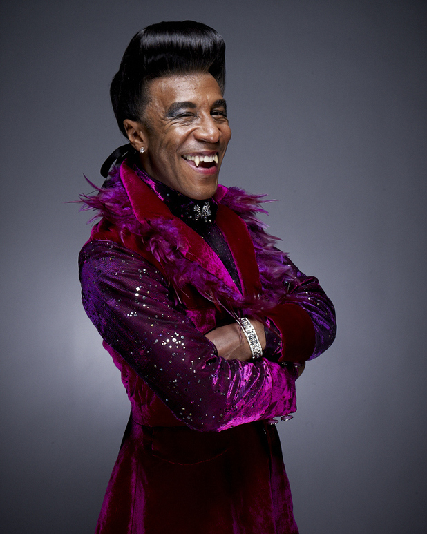
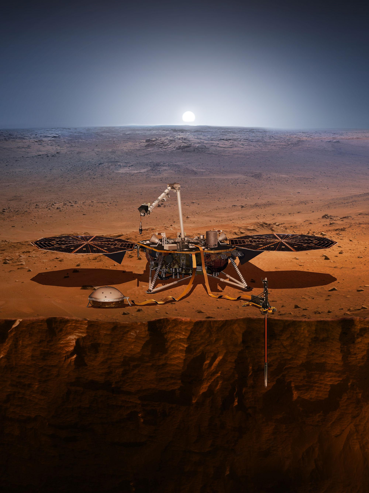
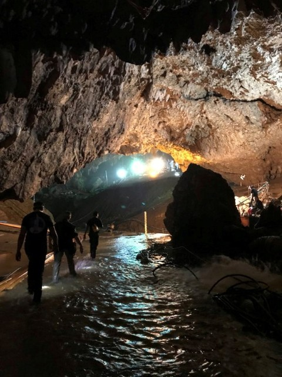
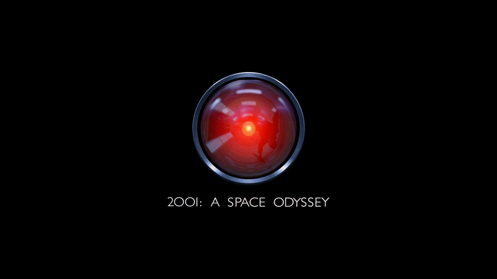

theme: Huerta, 2

# Round 4 Answers

---

## Question 1
In February SpaceX successfully conducts its maiden flight of its most powerful rocket to date. What is it called?

Falcon Heavy

---

## Question 2
Qantas launched their non-stop flight from London to Perth. How long does it take?

17 hours

---

## Question 3
The British sci-fi comedy Red Dwarf turned 30 this year.

Its early characters featured a human, a hologram, an android and a what?

A humanoid evolved from a cat. Known as "Cat".

---

## Question 4
Can you finish this quote from Stan Lee?
> With great power comes great

responsibility

---

## Question 5
In May 2018 NASA launched their InSight mission. In November it landed on which planet?

Mars

---

## Question 6
Who said this?

> Remember to look up at the stars and not down at your feet.

Stephen Hawking

---

## Question 7
In the Eurovision Song Contest 2018 Netta Barzilai won with which song?

Toy

---

## Question 8
In July there was a dramatic rescue of a young football team and their coach from the Tham Luang Nang Non cave in Thailand. How many people total were rescued?

12 boys and their coach (13)

---

## Question 9
Which company became the first company to achieve a market capitalization of $1 trillion in August?

Apple

---

## Question 10
What ground breaking Sci-Fi film turned 50 in 2018?

2001

(Barbarella also acceptable answer.)

---

# End of Answers!

## Pass the Answer Sheets to the Quizmasters
